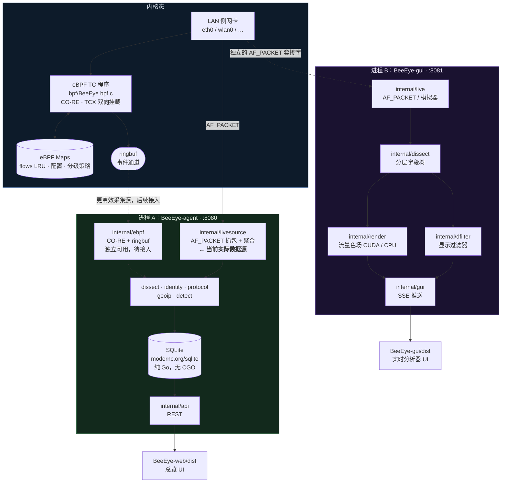
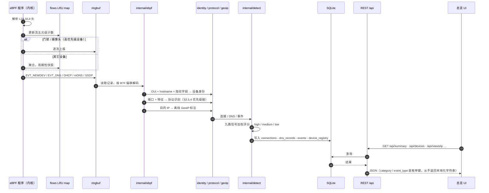
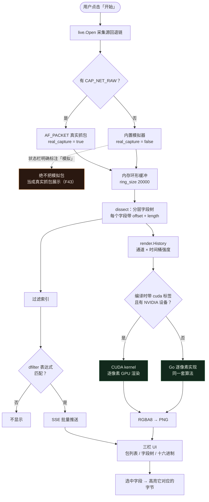
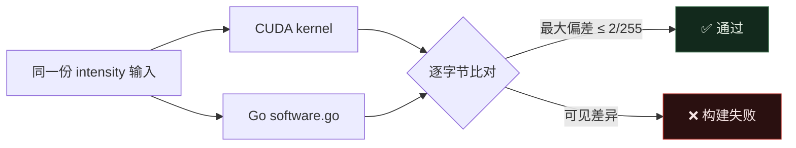
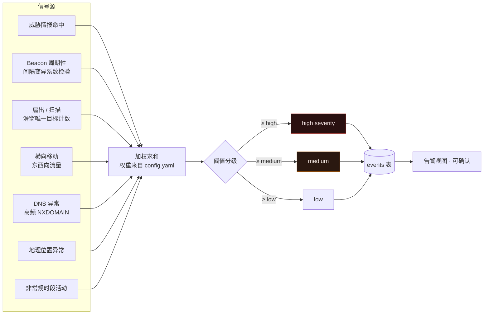
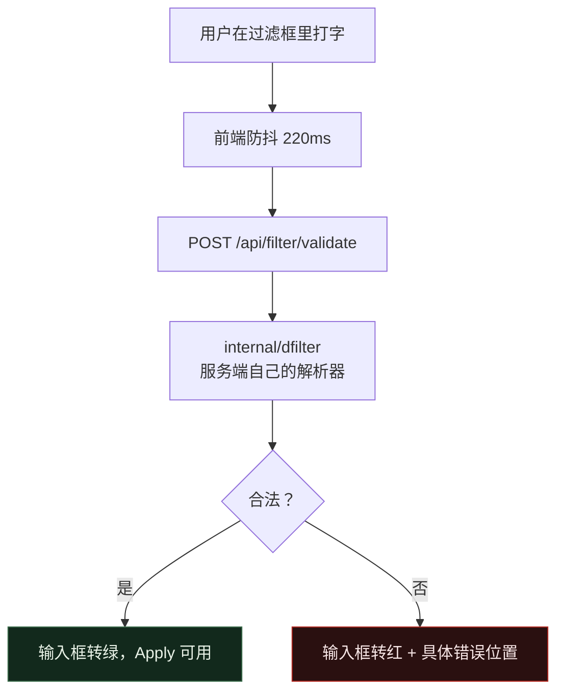
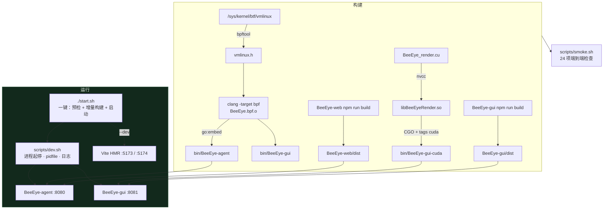
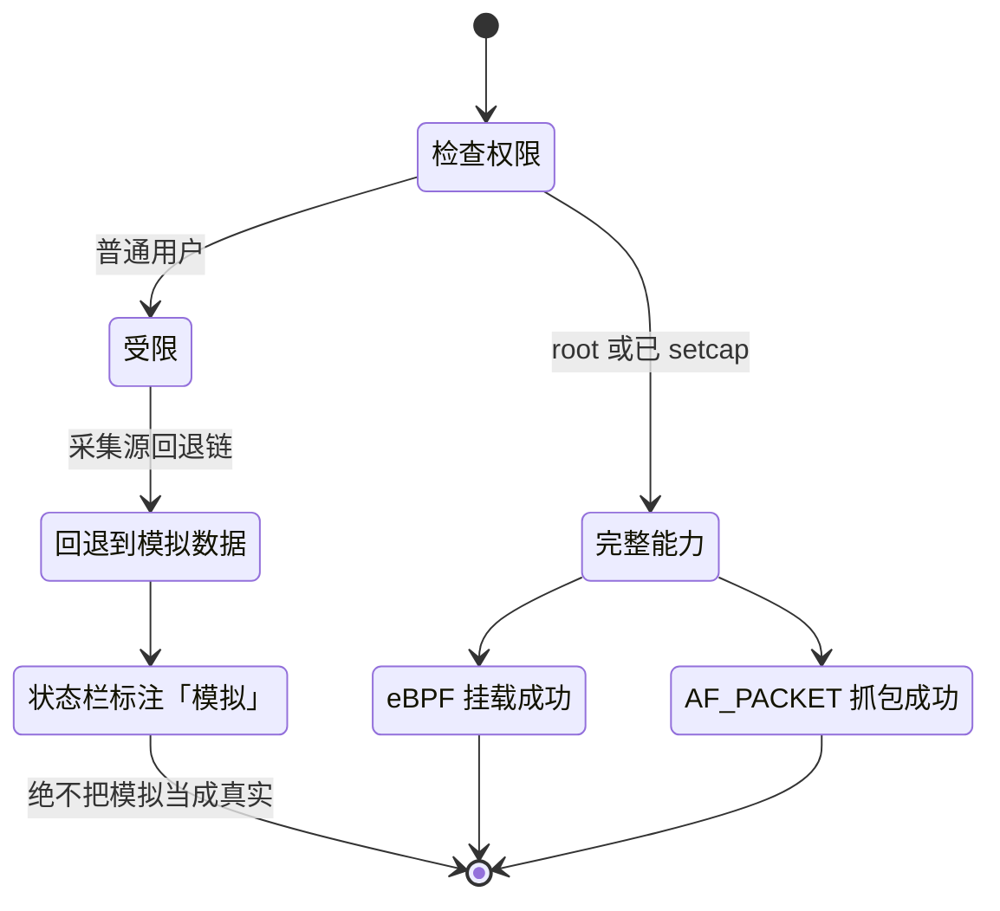
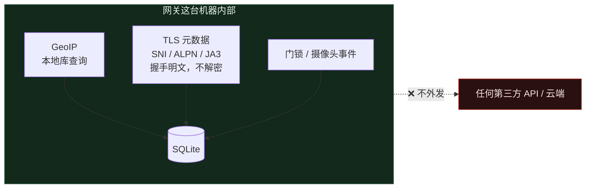

# 蜂眼 BeeEye — 核心技术栈与架构

> 本文描述的是**仓库里实际存在的代码**，不是设计意图。包名、端口、依赖、表名均可在源码中直接对照。
> 官网：https://www.beeeye.dev/
> 需求编号（F1–F44）对应 [program.md](program.md) §2.4，实现进度见 [PROGRESS.md](PROGRESS.md)。
>
> 最后更新：2026-08-19

---

## 1. 一句话概括

BeeEye 跑在已经承担家庭网络路由的 Ubuntu 主机上，用 eBPF 挂在 **LAN 侧**网卡上，识别每一台入网设备并观察它们在和谁通信 —— 不解密流量，也不需要在任何一台摄像头、门锁或手机上装 agent。

---

## 2. 系统总览：两个进程，两个 UI

两个前端回答的是**根本不同的问题**，因此拆成两个独立进程、独立端口、独立前端产物，任何一个崩溃都不会带走另一个（F42）。



| | 总览 UI | 实时分析器 |
|---|---|---|
| **地址** | http://localhost:8080 | http://localhost:8081 |
| **二进制** | `BeeEye-agent` | `BeeEye-gui` |
| **受众** | 家里所有人 | 正在排查问题的人 |
| **时间尺度** | 小时 → 周 | 毫秒 |
| **存储** | SQLite | 无，全部在内存里 |
| **运行时共享** | **无** —— 只在编译期共享源码包 | |
| **当前数据来源** | ✅ **真实抓包**（AF_PACKET） | ✅ **真实抓包**（AF_PACKET） |

> ### 数据来源：已接入真实抓包
>
> `BeeEye-agent` 通过 `internal/livesource` 实时抓包 —— 与分析器相同的 AF_PACKET 采集 ——
> 把结果聚合成设备/连接/DNS/告警写入 SQLite。**总览和分析器现在描述同一个真实网络**
> （本机 `192.168.x.x`）。
>
> 降级仍诚实（F43）：无 `CAP_NET_RAW` 或传 `-simulate` 时回退到模拟场景，并在启动日志标注
> `SIMULATED`。接口选择（F16）：`captureIface` 依次尝试 config 存在的接口 → 默认路由网卡 → `any`，
> 所以 config 里的 `wlan0`/`eth0` 与本机不符时会自动落到真实网卡。
>
> `internal/ebpf`（CO-RE + ringbuf）独立可用、有挂载测试，作为更高效采集源待接入 ringbuf；
> 当前真实抓包走 AF_PACKET 路径。详见 [PROGRESS.md](PROGRESS.md) §0。

---

## 3. 技术栈分层

```mermaid
flowchart LR
    subgraph L1["① 内核采集"]
        A1["eBPF CO-RE<br/>clang -target bpf"]
        A2["TCX 挂载<br/>ingress + egress"]
        A3["vmlinux.h<br/>由本机 BTF 生成"]
        A4["AF_PACKET<br/>分析器旁路"]
    end

    subgraph L2["② 用户态核心 · Go 1.25"]
        B1["cilium/ebpf<br/>加载 · ringbuf"]
        B2["协议解剖<br/>dissect 1.5k 行"]
        B3["显示过滤器<br/>dfilter 手写词法+语法"]
        B4["检测引擎<br/>detect 九路加权信号"]
        B5["进程归属<br/>procmap /proc 反查"]
    end

    subgraph L3["③ 存储与计算"]
        C1["SQLite<br/>modernc 纯 Go 实现"]
        C2["CUDA 色场渲染<br/>nvcc + CGO"]
        C3["CPU 等价实现<br/>逐像素同算法"]
    end

    subgraph L4["④ 前端 · 两套独立产物"]
        D1["React 18 + Vite 6"]
        D2["i18next<br/>zh-CN / en-US"]
        D3["CSS 变量主题<br/>6 主题 · 米黄/深色"]
        D4["SSE EventSource"]
    end

    L1 --> L2 --> L3 --> L4

    style L1 fill:#0d1b2a,color:#e6edf7,stroke:#35619e
    style L2 fill:#12291c,color:#e9f2e7,stroke:#386a48
    style L3 fill:#2a1810,color:#f7ece6,stroke:#a55200
    style L4 fill:#1a1230,color:#ece6f7,stroke:#6b4fa8
```



### 依赖清单（`go.mod` 直接依赖只有两个）

| 依赖 | 用途 | 为什么是它 |
|---|---|---|
| `modernc.org/sqlite` | 持久化 | **纯 Go 实现**，交叉编译到网关不需要 CGO 和 libsqlite3 |
| `gopkg.in/yaml.v3` | 配置解析 | `config/config.yaml`、`port-service-map.yaml` |
| `github.com/cilium/ebpf` | 间接 | 加载 eBPF 字节码、读 ringbuf |
| CUDA Toolkit | 可选 | 色场 GPU 渲染；没有就走 CPU 同算法路径 |

前端两套各自独立：`react` `react-dom` `i18next` `i18next-browser-languagedetector` `react-i18next` + `vite` `@vitejs/plugin-react`。**没有 UI 组件库、没有图表库** —— 图表是手写 SVG，配色从 CSS 变量里读，换主题时图表跟着重绘。

---

## 4. 总览侧数据流：一个包到一条告警

> 下图画的是 eBPF ringbuf 采集路径。当前 agent 的真实抓包走的是等价的 **AF_PACKET 路径**
> （`internal/livesource`）：抓包 → dissect 解剖 → 身份/协议/GeoIP → 检测 → 落库 → REST，
> 喂进去的是真实流量。



> **国际化的关键约定**：后端只返回**枚举键**（如 `camera`、`lateral_movement`），中英文文案全部在前端 `locales/` 里。这样切换语言不需要重新请求后端，也不会出现"数据库里存了中文"的问题（F18）。

---

## 5. 分析器实时链路



### 两个渲染后端为什么必须逐像素一致

色场的辉光项是每个像素在两个轴上对 13 抽头邻域的 gather，1024×288 一帧约 490 万次读取 —— 正是 GPU 擅长而 Go 逐像素循环不擅长的形状。但大多数家庭网关没有 NVIDIA 显卡，所以 CPU 路径不是占位符，而是**同一套数学的完整实现**。

`TestBackendsAgree` 用同一份输入分别在 GPU 和 CPU 上渲染，逐字节比对，防止两边在各自被修改时悄悄漂移（实测最大偏差 1/255）。



---

## 6. 检测引擎：多信号加权评分



**分级阈值全部在 `config/config.yaml` 里**，不同类别的设备用不同阈值 —— 一台摄像头连 30 个目标和一台笔记本连 30 个目标，含义完全不同。

---

## 7. 显示过滤器：一套语法，一个裁决者



前端**不做**第二套近似解析。校验和实际过滤用的是同一个解析器 —— 只有一套语法，只有一个裁决者，不会出现"前端说合法、后端却报错"。

支持子集：`&&` `||` `!`（也可写 `and` `or` `not`）、括号、`==` `!=` `>` `<` `>=` `<=`、`contains`、`matches`（正则）、地址字段上的 CIDR，以及裸协议名作为存在性判断。

> **与 Wireshark 唯一的有意分歧**：这里 `a != b` 表示 *没有任何* `a` 等于 `b`。Wireshark 的 `!=` 表示 *存在某个* 值不等，于是 `tcp.port != 443` 对每个包都成立（对端端口永远不是 443）。等价写法是 `!(a == b)`。

---

## 8. 构建与运行



```bash
./start.sh              # 构建过期部分并启动两个服务
./start.sh --dev        # 再加两个 Vite HMR 开发服务器
./start.sh stop|restart|status|logs
./start.sh --setcap     # 授予抓包 capability，免 root
make smoke              # 端到端验证两个服务的每个端点
```

`start.sh` 的增量判断用 `find -newer` 对比源码与产物；`npm install` 只在 lockfile 比 `node_modules` 新时才跑。

---

## 9. 权限与降级



需要的 capability：

```bash
sudo setcap cap_net_raw,cap_net_admin+ep       BeeEye-agent/bin/BeeEye-gui
sudo setcap cap_bpf,cap_net_admin,cap_perfmon+ep BeeEye-agent/bin/BeeEye-agent
```

**没有权限时不会失败** —— 分析器回退到合成流量，并在状态栏用明确的文字说明。它永远不会把模拟包当作真实抓包呈现（F43）。

---

## 10. 隐私边界



- GeoIP 查**本地**库，目的 IP 不会被逐个送到第三方 API
- 不解密 TLS。SNI、ALPN、JA3 来自握手阶段，设计上就是明文
- 可选的 TLS 解密与 MITM（program.md §3.10）**默认关闭**，且只适用于能装证书的设备 —— 这恰好排除了本系统要盯的那些固件写死证书的 IoT 设备

---

## 11. 目录结构

```
BeeEye-agent/            Go module —— 三个二进制
  bpf/                   eBPF C 源码 + 内核↔用户态事件契约
  cuda/                  CUDA 色场渲染器
  cmd/BeeEye-gui/        分析器入口
  cmd/BeeEye-tlspeek/    TLS 明文捕获命令行（F14，网关本机）
  internal/
    ebpf/                加载内核程序、读 ringbuf          685 行
    live/                采集源：AF_PACKET、模拟器          761 行
    dissect/             协议解剖 → 字段树 + 过滤索引     1498 行
    dfilter/             显示过滤器语言                     409 行
    analyze/             离线 pcap 文件分析                1488 行
    gui/                 分析器服务端：SSE、pcap 导出       835 行
    api/                 总览 REST API                      649 行
    render/              色场：CUDA 与 CPU 双后端           625 行
    detect/              检测引擎与加权评分                 586 行
    livesource/          实时抓包 → 聚合 → 落库（agent 采集源）507 行
    procmap/             本机进程归属                       450 行
    tlspeek/             TLS 明文捕获：uprobe + 库发现       705 行（新增）
    store/               SQLite 持久化                      420 行
    namemap/             IP ↔ 域名关联                      305 行
    capture/ pcapfile/ identity/ protocol/ geoip/ model/ config/
BeeEye-web/              总览 UI（React + Vite + i18next，6 主题）
BeeEye-gui/              分析器 UI（React + Vite + i18next，米黄/深色）
config/                  config.yaml、port-service-map.yaml
scripts/                 dev.sh、smoke.sh
start.sh                 一键启动
```

---

## 12. 几个值得注意的工程约束

| 约束 | 为什么 |
|---|---|
| 内核与用户态的结构体布局由**测试**保证一致 | `TestEventLayoutMatchesBTF` 从编译产物的 BTF 里读真实字段偏移，和 Go 解码器硬编码的偏移逐字段比对。C 头文件里调换一个字段的顺序会让**构建失败**，而不是产出乱码 IP |
| 解剖器必须能吃下截断包 | `TestTruncatedPacketsDoNotPanic` 对一个 ClientHello 帧的**每一个前缀长度**都重新解剖一遍 —— 真实抓包里 snaplen 截断是常态，绝不能 panic |
| JA3 的性质要可用 | 同一客户端重复握手（random 和 session id 不同）指纹必须相同，密码套件列表不同则指纹必须不同 |
| 进程归属宁可留白 | 别的设备的流量必须返回**未归属**，而不是硬安在某个巧合的本机进程上。包里不携带进程身份 |
| 图表配色只能来自 CSS 变量 | 组件里写死颜色会让切换主题时图表不跟着变 —— 而那正是多主题的全部意义 |
| 接口名从不硬编码 | 全部来自 `config/config.yaml`；挂 **LAN 侧**而不是 WAN 侧，NAT 之后设备级身份就没了 |
