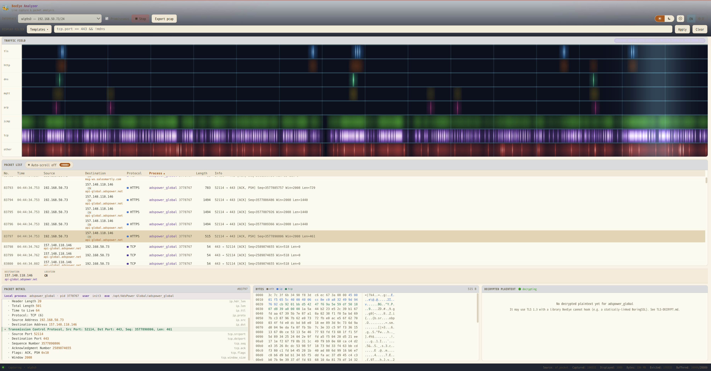
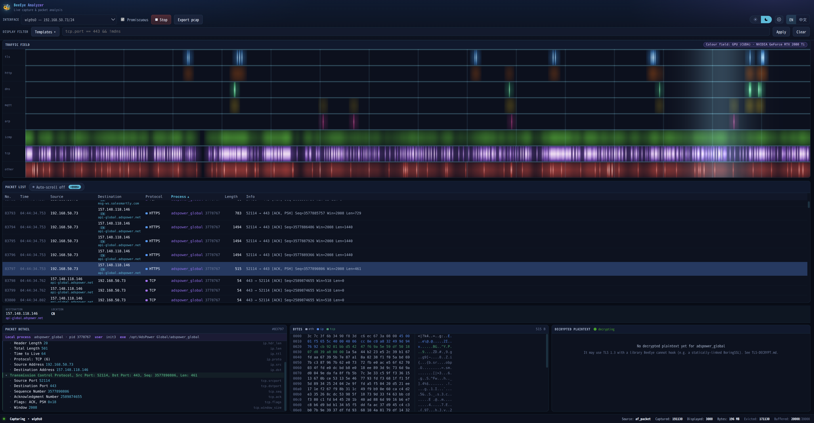
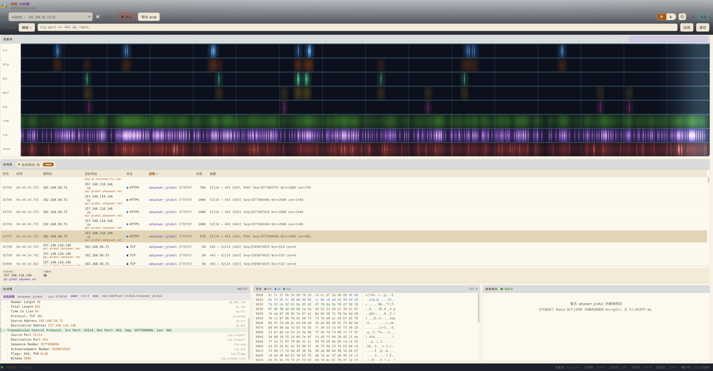
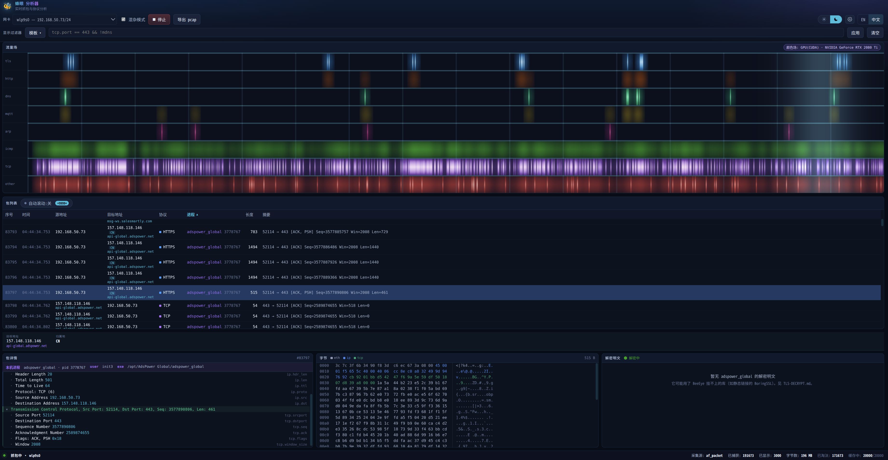

# 🐝 蜂眼 BeeEye

**家庭 IoT 网关流量分析 —— 基于 eBPF 的设备指纹识别、协议解剖与入侵后行为检测。**

[官网](https://www.beeeye.dev/) · [English](README.md) · [安装指南](INSTALL.zh-CN.md) · [使用手册](USAGE.md) · [架构说明](ARCHITECTURE.md) · [需求与设计](program.md) · [实现进度](PROGRESS.md) · [TLS 解密](TLS-DECRYPT.md) · [更新日志](CHANGELOG.zh-CN.md)

BeeEye 跑在已经承担家庭网络路由的 Ubuntu 主机上。它把 eBPF 程序挂到 LAN 侧网卡上，识别每一台入网设备，并观察这些设备在和谁通信 —— 不需要在任何一台摄像头、门锁或手机上安装 agent，也不解密**它们**的流量（唯一有意的例外是网关自己的进程——默认本地解密，对其它设备则是用户自愿开启——见[隐私](#隐私)一节）。

## 界面截图

实时分析器：同一份实时抓包，在浅色/深色主题与中/英文之间切换，无需刷新页面：

| 浅色 · English | 深色 · English |
|---|---|
|  |  |

| 浅色 · 中文 | 深色 · 中文 |
|---|---|
|  |  |

---

## 两个 UI，两个进程

BeeEye 提供两个独立前端，因为它们回答的是**根本不同的问题**。它们是独立进程、独立端口、独立前端产物，任何一个都不会拖垮另一个。

| | 总览 UI | 实时分析器 |
|---|---|---|
| **地址** | http://localhost:8080 | http://localhost:8081 |
| **二进制** | `BeeEye-agent` | `BeeEye-gui` |
| **面向** | 家里所有人 | 正在排查问题的人 |
| **时间尺度** | 小时 → 周 | 毫秒 |
| **展示** | 设备、告警、按 IP / 按协议视图、流量趋势 | Wireshark 式包列表、协议字段树、十六进制 |
| **存储** | SQLite | 无，分析全在内存里 |
| **数据来源** | ✅ **真实 AF_PACKET 抓包** | ✅ **真实 AF_PACKET 抓包** |

两者在编译期共享源码包，运行时不共享任何东西。

> ### 两个 UI 现在展示同一个真实网络
>
> `BeeEye-agent` 通过 `internal/livesource` 实时抓包 —— 与分析器相同的 AF_PACKET
> 采集 —— 所以总览和分析器现在描述的是同一台机器的真实网络（本机 `192.168.x.x`）。
> 无抓包权限、或传 `-simulate` 时，agent 回退到内置模拟场景并在启动日志中标注，
> 绝不把模拟当真实（F43）。详见 [PROGRESS.md §0](PROGRESS.md)。

---

## 环境要求

| | 最低 | 说明 |
|---|---|---|
| 内核 | Linux ≥ 5.8 且带 BTF | `/sys/kernel/btf/vmlinux` 必须存在。TCX 挂载需要 ≥ 6.6 |
| Go | 1.25 | |
| clang | ≥ 11 | 编译 eBPF 程序 |
| bpftool | 任意版本 | 生成 `vmlinux.h` —— `apt install linux-tools-$(uname -r)` |
| libbpf 头文件 | 任意版本 | `apt install libbpf-dev` |
| Node | ≥ 18 | 构建两个前端 |
| CUDA 工具链 | 可选 | GPU 色场渲染；CPU 路径产出完全相同的画面，始终可用 |

---

## 快速开始

```bash
./start.sh        # 预检 + 增量构建 + 启动两个服务
```

然后打开 **http://localhost:8080**（总览）和 **http://localhost:8081**（分析器）。

`start.sh` 会检查工具链、在 `vmlinux.h` 缺失时重新生成，并且**只重建过期的部分** —— 它用 `find -newer` 对比源码与产物，`npm install` 只在 lockfile 比 `node_modules` 新时才跑。第二次启动通常只要几秒。

```bash
./start.sh --dev        # 额外启动两个 Vite 开发服务器（热更新）
./start.sh stop|restart|status|logs
./start.sh --setcap     # 授予抓包 capability，从而不需要 root
./start.sh --rebuild    # 强制全量重建
./start.sh --iface eth0 # 指定分析器的抓包网卡
```

加上 `--dev` 会再得到 **http://localhost:5173**（总览 UI，热更新，`/api` 代理到 :8080）和 **http://localhost:5174**（分析器 UI，代理到 :8081）。这两个端口是**改前端时用的**：改一行 CSS 立刻生效，不用重新构建，也不会打断正在跑的抓包。生产环境不需要它们 —— Go 二进制直接伺服构建好的 `dist/`。

如果你想分步执行，原来的 make 目标都还在：`make bpf`、`make build`、`make frontends`、`make run`、`make smoke`。两条路径的日志都落在 `.run/`。

### 抓真实的包

eBPF 路径和分析器的 AF_PACKET 套接字都需要权限。**没有权限也不会失败** —— 分析器会回退到合成流量，并在状态栏用明确的文字说明。它永远不会把模拟包当作真实抓包呈现。

不用 root 也能真实抓包：

```bash
./start.sh --setcap     # 等价于下面两条
sudo setcap cap_net_raw,cap_net_admin+ep         BeeEye-agent/bin/BeeEye-gui
sudo setcap cap_bpf,cap_net_admin,cap_perfmon+ep BeeEye-agent/bin/BeeEye-agent
```

### 选择网卡

接口名从不硬编码。编辑 `config/config.yaml`：

```yaml
interfaces:
  mode: explicit
  explicit_list:
    - name: wlan0
      role: wifi_ap
    - name: eth0
      role: wan_uplink
```

挂 **LAN 侧**而不是 WAN 侧 —— 经过 NAT 之后，设备级的身份就没了。桥接环境下挂物理网卡或只挂网桥，两个都挂会把每个包重复计一次。

> 注意：仓库里默认配置写的是 `wlan0` / `eth0`，请改成你本机真实的网卡名。

---

## 实时分析器

三窗格，Wireshark 用户熟悉的布局：上方包列表，下方协议字段树与十六进制。选中一个字段会精确高亮它对应的那几个字节。

**每一列都可排序。** 点击表头按该列排序，再点一次反向，第三次回到抓包顺序 —— 抓包顺序是一种独立状态，也是唯一一种能让实时抓包持续讲得通的状态。地址按**数值**排序而不是字典序（按文本排的话 `192.168.1.9` 会排在 `192.168.1.10` 后面，那样的地址列没法用），IPv4、IPv6、MAC 各自成一整块。排序会释放自动滚动 —— 列表不在抓包顺序时，跟随末尾没有意义。

**显示过滤器**使用 Wireshark 语法的一个有意选取的子集：

```
tcp.port == 443 && !mdns
ip.addr == 192.168.1.0/24 and dns.qry.name contains "tuya"
tls.handshake.extensions_server_name matches "^ota\."
dns.flags.rcode == 3 || (tcp.flags.syn == 1 && tcp.flags.ack == 0)
```

支持：`&&` `||` `!`（也可写 `and` `or` `not`）、括号、`==` `!=` `>` `<` `>=` `<=`、`contains`、`matches`（正则）、地址字段上的 CIDR，以及裸协议名作为存在性判断。过滤框在你输入时就用**服务端自己的解析器**校验 —— 只有一套语法，不是两套。

**模板菜单**提供现成的过滤器（按协议、按地址、排查场景、降噪）。选中一条会与你已有的表达式取 AND，并且仍然可编辑。

> **与 Wireshark 唯一的有意分歧**：这里 `a != b` 表示*没有任何* `a` 等于 `b`。Wireshark 的 `!=` 表示*存在某个*值不等，于是 `tcp.port != 443` 对每个包都成立，因为对端端口永远不是 443。等价写法是 `!(a == b)`。

### 进程归属

本地端点是**网关自身 socket** 的流量会被归属到持有它的进程（`/proc/net/*` → inode → `/proc/*/fd`，与 `ss -p` 同一套机制）。

其他设备之间的流量会显示为*不是本机*，而不是猜一个。包里不携带进程身份；在网关上没有任何可恢复的信息能说明是摄像头上的哪个程序发的。对这类流量，最强的身份就是设备本身。

### 流量色场

包列表上方那条带子是实时瀑布图：每个协议一行，**色相承载身份、亮度承载量级**，所以一次 MQTT 突发绝不会看起来像一次 DNS 突发。

在装有 NVIDIA 显卡并用 `make build-cuda` 构建时，它由 CUDA 内核（`BeeEye-agent/cuda/BeeEye_render.cu`）逐像素渲染；否则由一份等价的 Go 实现渲染。状态徽章会标明**实际在跑的**是哪一个。两者由一个测试约束为产出相同图像 —— 它分别渲染再逐像素比对。

---

## 目录结构

```
BeeEye-agent/            Go module —— 两个二进制
  bpf/                   eBPF C 源码 + 内核↔用户态事件契约
  cuda/                  CUDA 色场渲染器
  cmd/BeeEye-gui/        分析器入口
  internal/
    ebpf/                加载内核程序、读 ringbuf
    live/                采集源：AF_PACKET、模拟器、帧构造
    dissect/             协议解剖 → 字段树 + 过滤索引
    dfilter/             显示过滤器语言
    procmap/             本机进程归属
    render/              色场：CUDA 与 CPU 双后端
    gui/                 分析器服务端（SSE、pcap 导出）
    api/                 总览 REST API
    store/ detect/ identity/ protocol/ geoip/ model/ config/ analyze/ namemap/ capture/ pcapfile/
BeeEye-web/              总览 UI（React + Vite + i18next，6 套主题）
BeeEye-gui/              分析器 UI（React + Vite + i18next，米黄／深色）
config/                  config.yaml、port-service-map.yaml
scripts/                 dev.sh、smoke.sh
start.sh                 一键启动
```

---

## 测试

```bash
make test           # 单元测试
make test-cuda      # 外加 GPU/CPU 渲染器一致性检查
make bpf-verify     # 证明 eBPF 程序能通过内核验证器
make smoke          # 两个服务端到端
```

几个值得一提的检查，因为它们覆盖的正是最容易悄无声息坏掉的东西：

- `internal/ebpf` 读取编译产物的 **BTF**，把真实的结构体字段偏移与 Go 解码器的硬编码偏移逐个比对 —— C 头文件里调换一个字段顺序会让**构建失败**，而不是产出乱码 IP。
- `internal/dissect` 对一个 TLS ClientHello 帧的**每一个前缀长度**都重新解剖一遍；真实抓包里 snaplen 截断是常态，绝不能 panic。
- JA3 被检验的是让它有用的那个性质：同一客户端重复握手时稳定，密码套件列表不同时相异。
- `internal/procmap` 验证其他设备的流量返回**未归属**，而不是硬安在某个巧合的本机进程上。
- `internal/render` 在 GPU 和 CPU 上渲染同一帧并比对。

---

## 隐私

- GeoIP 查**本地**数据库。目的 IP 不会被逐个送到第三方 API。
- 门锁与摄像头的事件留在这台机器上。什么都不会上传。
- 线上的 TLS 不解密。SNI、ALPN、JA3 来自握手阶段，设计上就是明文。
- **一个有意的例外，默认关闭、且只限网关本机**：`BeeEye-tlspeek`（F14）可以通过给 OpenSSL 库挂 uprobe，读取*运行在网关本机上*的 TLS 进程的明文 —— 与 `procmap` 已经能按名字归属的是同一批进程、同一份内容。它触及不到摄像头、门锁或手机上的任何东西，那些库跑在它们自己的硬件上。它是一个独立命令，在你启动并指定目标之前什么都不抓 —— 这也是本行不再无条件写「不解密 TLS」的原因。设计与边界见 [TLS-DECRYPT.md](TLS-DECRYPT.md)。
- 可选的 TLS 解密与 MITM（program.md §3.10）默认关闭，且只适用于你能安装证书的设备 —— 这恰好排除了本系统要盯的那些固件写死证书的 IoT 设备。
- [eCapture](https://github.com/gojue/ecapture) 采用的 uprobe 方案从另一侧撞上同一堵墙：它只能触及**本内核上**运行的 TLS 库，因此能解密网关自己的进程，对摄像头或门锁上的任何东西都无能为力。完整评估（包括它在这里确实有用的地方）见 [TLS-DECRYPT.md](TLS-DECRYPT.md)；其中的阶段一 —— 网关本机、text 模式的明文捕获 —— 已实现为 `BeeEye-tlspeek`，并有一个解密真实 TLS 会话的测试覆盖。

---

## 状态

本项目正在活跃开发中。[PROGRESS.md](PROGRESS.md) 逐条跟踪每个需求（F1–F44）的真实状态与具体缺口，并与代码保持同步。[ARCHITECTURE.md](ARCHITECTURE.md) 用图说明各部分如何组合在一起。

**今天端到端可用的**：两个 UI、REST API、显示过滤器引擎、协议解剖器、检测引擎、pcap 导出、CUDA/CPU 色场 —— `scripts/smoke.sh` 检查其中 24 条路径，24 条全过。

agent 已通过 AF_PACKET 实时抓包，仅在无抓包权限时回退到模拟场景（会标注）；把 eBPF ring buffer 接为更低开销的采集源是主要的后续采集任务（见上文提示）。

---

## 参考与致谢

BeeEye 不是凭空而来 —— 设计上直接借鉴了下面几个项目，代码上则依赖下面这些开源库。

**设计参考**

- **[Wireshark](https://www.wireshark.org/)** —— 三窗格（包列表 / 协议字段树 / 十六进制视图）布局、`internal/dfilter` 实现的兼容子集显示过滤器语法、以及 JA3/TLS 字段命名，全部有意沿用 Wireshark 的习惯，让肌肉记忆能直接复用。
- **[eCapture](https://github.com/gojue/ecapture)** —— `BeeEye-tlspeek`（F14）的 uprobe TLS 明文捕获设计跟随 eCapture 开创的思路（挂载到加密库的读写函数上，不做 MITM、不需要在目标上装证书）。它的模块清单同时也是 BeeEye 自身缺口的路线图：GoTLS、GnuTLS、NSS 覆盖，以及 pcap+keylog 合并导出，目前仍是待办（见 [PROGRESS.md](PROGRESS.md) F14/F45）——正因为 eCapture 已经证明这些都可行,才把它们列进了计划。两个项目的能力边界在哪里分岔（本项目只做网关本机、且是故意的）见 [TLS-DECRYPT.md](TLS-DECRYPT.md)。
- **[Pcap-Analyzer](https://github.com/HatBoy/Pcap-Analyzer)** —— 离线分析视图（协议/会话方/会话统计、凭证提取、文件提取、攻击模式启发式检测）的功能形态，`internal/analyze` 与总览 UI 的「抓包分析」页签都仿照了它的思路。

**依赖的开源库**

| 库 | 用途 |
|---|---|
| [cilium/ebpf](https://github.com/cilium/ebpf) | 加载/挂载 eBPF CO-RE 程序、读取 ringbuf 的 Go 绑定 |
| [modernc.org/sqlite](https://gitlab.com/cznic/sqlite) | 纯 Go 实现的 SQLite（无需 CGO），承载总览的存储层 |
| [oschwald/geoip2-golang](https://github.com/oschwald/geoip2-golang) + [maxminddb-golang](https://github.com/oschwald/maxminddb-golang) | 读取 MaxMind 格式的 `.mmdb` GeoIP 数据库，完全离线 |
| [golang.org/x/sys](https://pkg.go.dev/golang.org/x/sys) | 原始 AF_PACKET 套接字与 RTNETLINK 热插拔监听 —— 不依赖 libpcap，无需 CGO |
| [gopkg.in/yaml.v3](https://github.com/go-yaml/yaml) | 解析 `config.yaml` / `port-service-map.yaml` |
| [React](https://react.dev/) + [Vite](https://vitejs.dev/) | 两套前端 SPA |
| [react-i18next](https://react.i18next.com/) / [i18next](https://www.i18next.com/) | 两套前端的中英文双语界面 |
| [NVIDIA CUDA](https://developer.nvidia.com/cuda-toolkit) | 流量色场渲染的可选 GPU 路径 —— CPU 兜底与其逐位一致，且始终可用 |

另外要感谢 **[Spamhaus](https://www.spamhaus.org/)** 提供 `internal/threatintel` 拉取的 DROP 威胁情报 CIDR 名单（F29），以及 **[MaxMind GeoLite2](https://dev.maxmind.com/geoip/geolite2-free-geolocation-data)** 的数据库格式 —— 如果你在 `data/` 下放一份，地理定位会比内置的粗表更准确。
