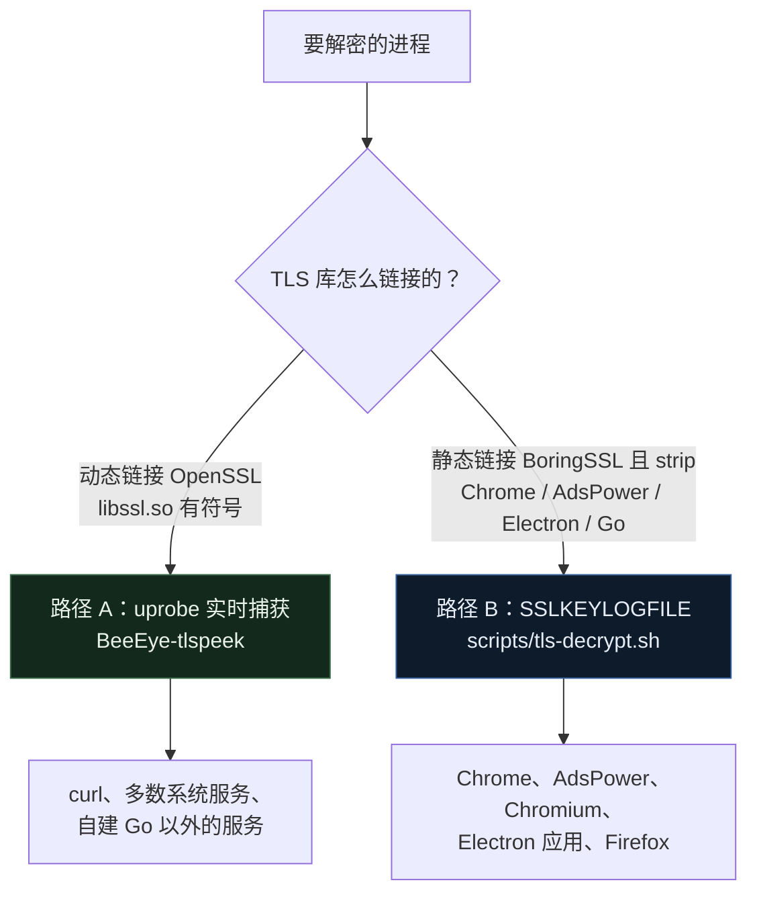
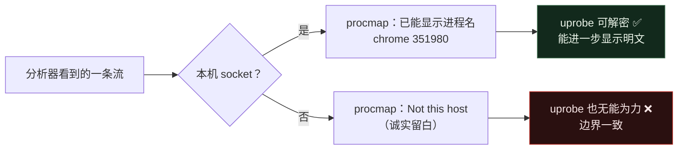
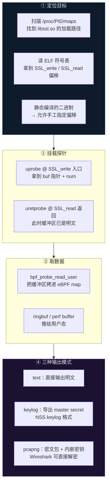
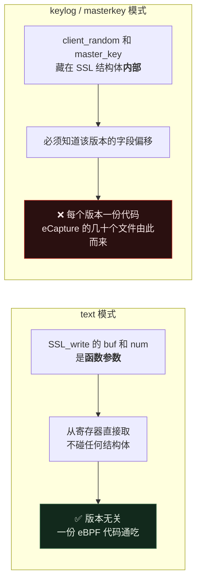
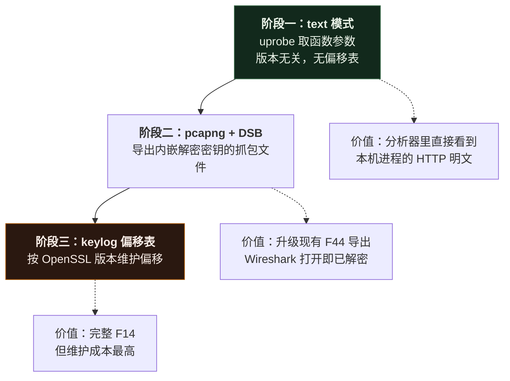
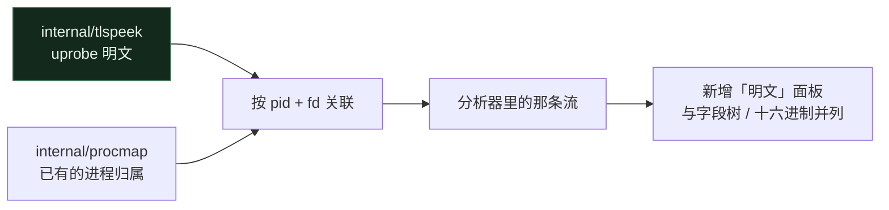

# HTTPS 明文捕获 —— 参考 gojue/eCapture 的技术方案评估

> 对应需求 F14（uprobe/SSLKEYLOGFILE）/ F15（主动 MITM，建议不做）/ F45（手机端可选 MITM，已实现）。
> 官网：https://www.beeeye.dev/
> 参考实现：[gojue/ecapture](https://github.com/gojue/ecapture)
>
> 撰写日期：2026-08-19 · 阶段一已实现：2026-08-19 · F45 已实现：2026-08-19

---

## 实现状态

**阶段一（text 模式）已经实现并实测通过。** 见 `internal/tlspeek/` 与 `cmd/BeeEye-tlspeek/`。

| 组件 | 文件 | 状态 |
|---|---|---|
| eBPF uprobe 程序 | `bpf/BeeEye_tls.bpf.c` | ✅ 三个程序通过内核验证器 |
| 内核↔用户态契约 | `bpf/BeeEye_tls_events.h` | ✅ BTF 布局测试锁定 |
| 事件解码 | `internal/tlspeek/event.go` | ✅ |
| 库发现 | `internal/tlspeek/discover.go` | ✅ 扫 `/proc/*/maps` |
| 探针挂载 | `internal/tlspeek/peeker.go` | ✅ uprobe + uretprobe |
| 命令行工具 | `cmd/BeeEye-tlspeek/` | ✅ |

**实测证据**：`TestCapturesRealTLSPlaintext` 在两个真实 openssl 进程间建立 TLS 会话，从 ringbuf 里捞回客户端写入的标记字符串。命令行工具对一次真实的 `curl https://example.com` 完整还原出 HTTP/2 请求前奏与返回的 `<!doctype html>...<title>Example Domain</title>`，带进程名与 pid。

**尚未做**（与下文分阶段一致）：pcapng+DSB 导出（阶段二）、keylog 偏移表（阶段三）、GnuTLS/NSS/Go crypto/tls、以及接入分析器 UI 的「明文」面板。当前入口是独立命令行工具，这是**有意的隐私设计** —— 读取内容的功能不应常驻在分析器里。

**尚未改**：README 的「不解密 TLS」承诺还需按下文 §3 的要求改写为「不解密其他设备的 TLS」。

### 两条解密路径，覆盖不同目标

实测发现：Chrome、AdsPower 这类浏览器**无法用 uprobe 按符号名挂载**，因为它们把 BoringSSL **静态链进主二进制并 strip 了符号**（`nm -D /opt/google/chrome/chrome` 里没有任何 `SSL_write`/`SSL_read`）。因此实现了两条互补的路径：



| | 路径 A：uprobe | 路径 B：SSLKEYLOGFILE |
|---|---|---|
| 工具 | `BeeEye-tlspeek` | `scripts/tls-decrypt.sh` |
| 机制 | 挂 `SSL_write`/`SSL_read` 读明文缓冲区 | 浏览器把主密钥写入 keylog，配合抓包解密 |
| 适用 | 动态链接 OpenSSL 且**符号未 strip** | **任何 Chromium/Electron/Firefox**，及静态链接目标 |
| 前提 | 目标进程正在运行即可挂 | 必须由脚本**启动/重启**目标（keylog 只覆盖启动后的会话） |
| 输出 | 实时逐条明文 | 抓包 + keylog → tshark 解密 |
| Chrome/AdsPower | ❌ 符号被 strip，挂不上 | ✅ **可用** |

**为什么 Chrome 只能走路径 B**：静态链接的 strip 二进制里没有符号名可挂，按偏移挂载又需要针对每个版本逆向定位 `SSL_write` 的字节偏移（研究级、且随版本失效）。而 SSLKEYLOGFILE 是 Chromium **自带支持**的机制，稳定可靠，这正是它成为浏览器标准解密手段的原因。代价是必须在启动时设好环境变量 —— 对已经在跑、且当初没带该变量的 Chrome，因 TLS 前向保密无法事后解密。

**路径 B 实测**：`scripts/tls-decrypt.sh capture --app chrome --url https://example.com` 一条命令完成抓包+启动+解密，还原出明文 SNI（`clientservices.googleapis.com` 等）、HTTP/2 请求（`GET /chrome-variations/seed?...`、完整 User-Agent）与响应（`302 · text/html · ClientMapServer`）。AdsPower 同理（Electron+Chromium，二进制 `/opt/AdsPower Global/adspower_global`）。

---

---

## 0. 先说结论（这一条决定了整个方案的边界）

eCapture 的原理是 **uprobe 挂在用户态 TLS 库的函数上**，在加密之前 / 解密之后把明文缓冲区读出来。它的官方文档写得很明确：

> The TLS process must execute on **the same Linux/Android kernel** where eCapture runs.

也就是说：**这项技术只能解密运行在网关本机上的进程的 TLS 流量。**

对 BeeEye 而言，这意味着：

| 目标 | 能否用这套技术解密 | 原因 |
|---|---|---|
| 网关自己上面跑的进程（curl、chrome、你自己的服务） | ✅ 可以 | libssl 在本机内核上运行，uprobe 挂得上 |
| 摄像头 / 门锁 / 电视 / 手机 | ❌ **不可能** | 它们的 TLS 库跑在它们自己的硬件上，网关的 eBPF 够不着 |

而 BeeEye 存在的理由恰恰是盯住后面那一类设备。所以**这套方案无法直接服务于本项目的主线目标** —— 这和 program.md §3.10 已经写明的 MITM 局限是同一堵墙：只对"你能装证书的设备"有效，而这恰好排除了固件写死证书的 IoT 设备。

### 那它对 BeeEye 还有什么价值？

有，而且契合得相当好：**它正好补上分析器现在留白的那一半**。

`internal/procmap` 现在已经能把「本机 socket 的流量」归属到具体进程（`chrome 351980`），把别的设备的流量诚实地标成 `Not this host`。而 uprobe 能解密的流量集合，**和 procmap 能归属的流量集合是同一个集合**。



结论：**把它定位成「网关自身流量的明文视图」，而不是「IoT 设备解密」。** 这样它是一个诚实、边界清晰、且与现有进程归属功能天然咬合的特性。

---

## 1. eCapture 的实现机制拆解



### 支持的库与挂载点

| 库 | 挂载的函数 |
|---|---|
| OpenSSL / BoringSSL | `SSL_write` · `SSL_read`（含 `_ex` 变体） |
| GnuTLS | `gnutls_record_send` · `gnutls_record_recv` |
| NSS / NSPR | `PR_Write` · `PR_Read` · `PR_Send` · `PR_Recv` |
| Go `crypto/tls` | `(*Conn).Write` · `(*Conn).Read`，需处理 Go 寄存器 ABI |

### 版本差异是怎么处理的 —— 这一点最关键

eCapture 的 `kern/` 目录里躺着**几十个按版本命名的 eBPF C 文件**：

```
openssl_1_0_2a_kern.c   openssl_1_1_0a_kern.c   openssl_1_1_1a_kern.c
openssl_1_1_1b_kern.c   openssl_1_1_1d_kern.c   openssl_1_1_1j_kern.c
openssl_3_0_0_kern.c … openssl_3_5_0_kern.c
gnutls_3_6_12 … gnutls_3_8_7        boringssl_a_13 … boringssl_a_16
openssl_masterkey.h  openssl_masterkey_3.0.h  openssl_masterkey_3.2.h
```

为什么要这么多份？因为 **master secret 藏在 `SSL` 结构体里**，而这个结构体的字段偏移每个版本都在变。要读 `ssl->s3->client_random` 就必须知道该版本的确切偏移，于是只能一个版本编一份。

**但这里有一个非常重要的区分：**



**这直接决定了实施顺序**：text 模式的复杂度比 keylog 模式低一个数量级，而且不会随 OpenSSL 发版腐烂。

---

## 2. 给 BeeEye 的落地方案

### 分阶段



### 阶段一的具体设计（映射到现有代码结构）

新增包 `internal/tlspeek`：

| 文件 | 职责 |
|---|---|
| `discover.go` | 扫 `/proc/<pid>/maps` 找 `libssl.so`；读 ELF 动态符号表拿 `SSL_write`/`SSL_read` 的偏移；静态链接的二进制支持手工指定 |
| `attach.go` | `link.OpenExecutable` + `Uprobe`/`Uretprobe`（cilium/ebpf 已是现有依赖，无需引入新库） |
| `event.go` | ringbuf 记录解码：pid/tid、方向、fd、明文分片 |
| `assemble.go` | 分片重组 —— 一次 `SSL_write` 不等于一个 TCP 段，需要按 (pid, fd) 拼接 |

新增 eBPF 源 `bpf/BeeEye_tls.bpf.c`：

```c
// 关键点：buf 和 num 都是函数参数，从 PT_REGS_PARM 直接取，
// 不需要知道任何 OpenSSL 版本的结构体布局。
SEC("uprobe/SSL_write")
int probe_ssl_write(struct pt_regs *ctx) {
    void *buf = (void *)PT_REGS_PARM2(ctx);
    int   num = (int)PT_REGS_PARM3(ctx);
    // bpf_probe_read_user(...) → ringbuf
}

// SSL_read 必须挂 uretprobe：入口时缓冲区还没填,
// 返回时里面才是解密后的明文，返回值即实际长度。
SEC("uretprobe/SSL_read")
int probe_ssl_read_ret(struct pt_regs *ctx) { ... }
```

与现有架构的接口：



因为 procmap 已经建立了 `flow ↔ (pid, fd)` 的映射，明文事件只要带上 pid 和 fd 就能直接挂到对应的流上 —— **这块粘合层已经存在了**。

---

## 3. 必须一并解决的问题

| 问题 | 说明 |
|---|---|
| **权限** | uprobe 需要 `CAP_BPF` + `CAP_PERFMON`（内核 5.8+），与现有 `setcap` 清单一致，无需 root |
| **隐私** | 这是本项目第一个真正读取**内容**而非元数据的功能。README 的「隐私」一节承诺"不解密 TLS"，上线必须同步改写，并且**默认关闭**、需显式指定目标进程 |
| **不能全局开** | 无差别挂 uprobe 会把网关上所有进程的明文（含密码、token）打进日志。必须按 pid / 可执行文件白名单启用 |
| **性能** | 每次 `SSL_write` 都触发一次用户态陷入。大流量进程上开销显著，需要限流与长度截断 |
| **Go 程序** | Go 静态链接自己的 `crypto/tls`，符号是 `crypto/tls.(*Conn).Write`，且用寄存器 ABI；作为独立子任务，不进阶段一 |

---

## 4. 建议

1. ~~先做阶段一（text 模式）~~ **已完成** —— 版本无关、复杂度可控、和现有 procmap 天然咬合。
2. **明确改写 README 的隐私承诺**，把「不解密 TLS」限定为「不解密其他设备的 TLS」，并说明本机进程明文捕获默认关闭。
3. **暂不实现 keylog 偏移表（阶段三）** —— eCapture 用几十个按版本编译的 eBPF 文件才撑住这件事，对本项目是不成比例的维护负担；等阶段一稳定、确有需求再说。
4. **F15（主动 MITM）依然建议不做** —— 对目标 IoT 设备无效，且需要在设备上装证书，与本项目"无需在任何设备上装 agent"的前提直接冲突。

---

## 5. F45：手机端可选 MITM 解密（已实现）

与 F15 是两个不同的功能，边界很清楚：**F15 是无差别、对全部设备的 MITM（不做）；F45 只对用户主动选择接入、并自行安装 BeeEye 根证书的那台设备生效**（手机、电脑），跟 Surge/Burp/mitmproxy 的使用模型一样。没装证书的设备（门锁、摄像头等）连接会直接失败，不存在静默明文透传——这是`internal/mitm`里反复验证过的行为，不是一句承诺。

### 实现

新增包 `internal/mitm`：

| 文件 | 职责 |
|---|---|
| `ca.go` | 生成/加载本地根 CA（ECDSA P-256，自签名，10 年有效期）；私钥 `ca.key` 落盘 0600 权限 |
| `leaf.go` | 按 SNI 动态签发叶子证书并缓存（共用一把叶子私钥，只是换证书，不是每个域名都重新生成密钥） |
| `proxy.go` | HTTP CONNECT 代理：用刚签发的证书终止客户端 TLS，再向真实源站发起**完全校验**（无 `InsecureSkipVerify`）的 TLS 连接转发 |
| `mobileconfig.go` | 把 CA 包成 Apple Configuration Profile（`.mobileconfig`），iOS/macOS 上有名称和说明的一键安装提示，而不是一个陌生的 PEM 文件 |

**范围边界**：只处理 `CONNECT`（HTTPS）。普通 HTTP 请求直接返回 400——明文本来就不需要解密，这不是遗漏。

**实测**（非模拟）：`internal/mitm` 的 3 项单元测试之外，用真实二进制对真实网站 `https://example.com` 走了一遍完整链路——`curl --cacert <生成的CA> -x 127.0.0.1:18443 https://example.com/` 拿到解密后的真实响应体；换成不信任该 CA 的 curl，连接直接被拒绝（"tls: bad certificate"），验证了"失败关闭"而非"静默明文透传"。`.mobileconfig` 用 Python `plistlib` 解析确认是合法的 Apple 配置描述文件，而不只是格式正确的 XML。

### API

| 端点 | 用途 |
|---|---|
| `GET /api/mitm/status` | 是否启用、监听地址、CA 指纹、已记录的解密条数 |
| `GET /api/mitm/ca.pem` | 下载根证书（Android / Windows / macOS 手动导入用） |
| `GET /api/mitm/ca.mobileconfig` | 下载配置描述文件（iOS/macOS 一键安装体验更好） |
| `GET /api/mitm/exchanges` | 最近解密的请求/响应列表（内存环形缓冲，重启即清空，同 `internal/analyze.Store` 的设计考虑——这是本项目处理过的最敏感数据，绝不落盘） |
| `GET /api/mitm/exchanges/{id}` | 单条完整记录，含请求头/响应头与 body（base64） |

默认关闭（`mitm.enabled: false`），需要在 `config.yaml` 显式打开并重启。

### 各平台"装了证书之后"的差异——这一步比证书格式本身更容易踩坑

证书文件格式（X.509 PEM/DER）四个平台通用，`ca.pem` 都能用。但**让系统/应用真正信任它**这一步，四个平台不一样，装完不代表马上生效：

| 平台 | 差异点 |
|---|---|
| Android | 设置里走"安装证书→CA 证书"即可，但 **Android 7+（API 24+）默认只信任系统预装根证书**——用户装的 CA 默认不会被 targetSDK ≥ 24 的 App 信任，除非该 App 的 network security config 显式声明信任用户证书。系统浏览器能被解密，很多做了证书锁定的 App（银行、部分社交类）装了也没用。 |
| iOS / iPadOS | 装完 `.mobileconfig` 后**还要手动去**设置 → 通用 → 关于本机 → 证书信任设置，把这个根证书的"完全信任"打开，否则 profile 装了也不生效——这是苹果对任何用户新增根证书的强制要求，没有 profile 字段能跳过这一步。 |
| macOS | 双击 `ca.pem`/`.mobileconfig` 进钥匙串访问后，**同样要手动**把该证书的信任设置改成"始终信任"，默认的"使用系统默认值"不会生效。 |
| Windows | `.cer` 双击进证书导入向导，**必须手动选到"受信任的根证书颁发机构"**这个存储位置——选到"个人"证书装了也不生效。 |
| 任意平台的 Firefox | 有自己独立的证书库，**不读取系统信任链**，得在 Firefox 设置里单独导入这份 CA，否则系统层面装了证书，Firefox 里访问 HTTPS 网站照样报证书错误。 |

这些是所有 MITM 代理工具（mitmproxy/Charles/Burp）共有的通病，不是 BeeEye 特有的限制——记在这里是为了让"装了证书却没生效"不必每次都重新踩坑排查。
